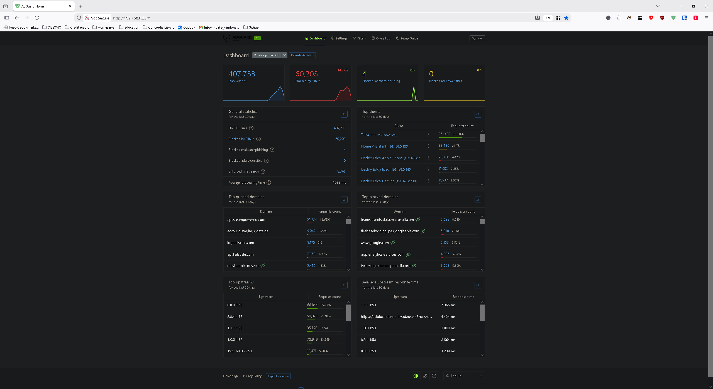
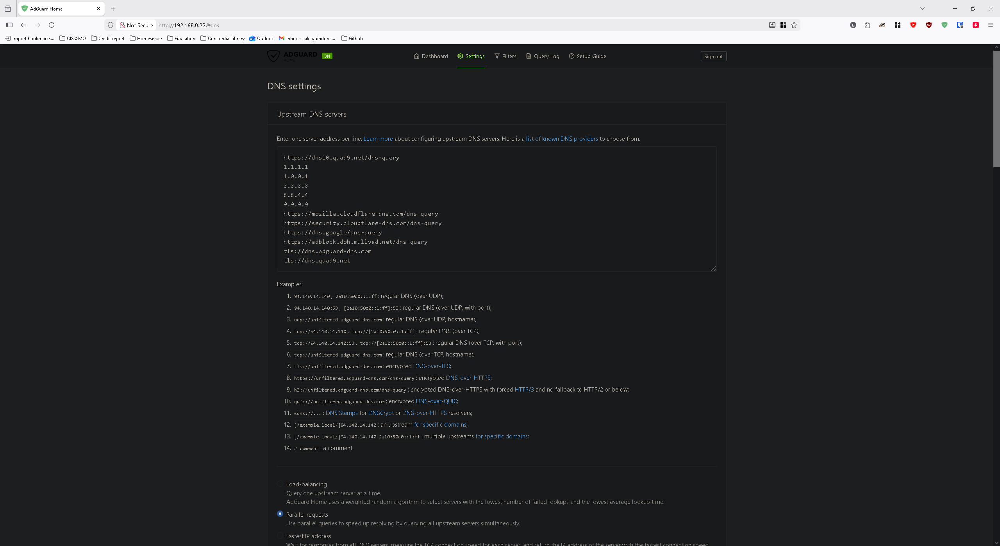
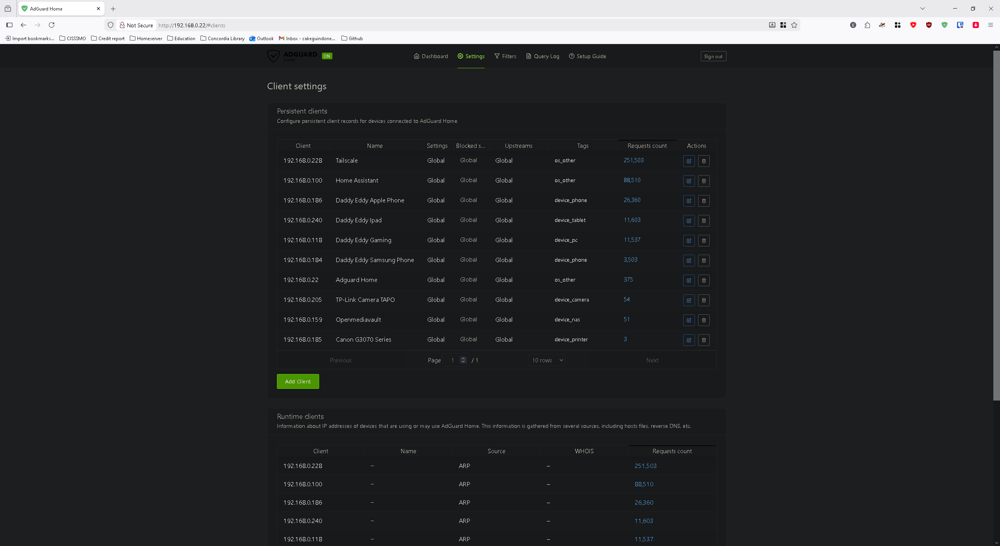
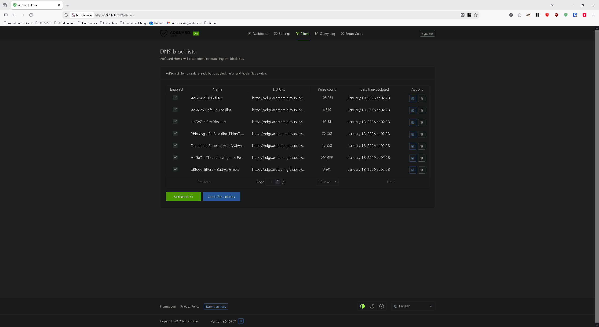
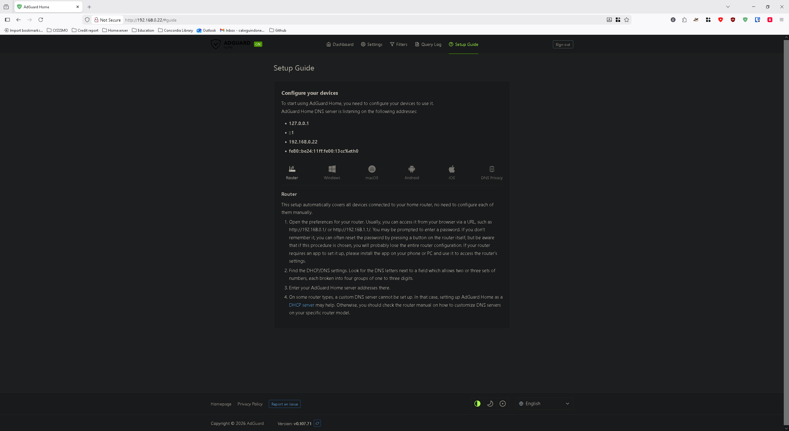

<h1 align="center"> Adguard Home </h1>

The reason I installed [Adguard Home](https://adguard.com/en/adguard-home/overview.html) was mainly to read my manhuas on my Ipad without having adds popping up there and there whenever I clicked on the screen. Of course it help with browsing online, but manhuas was my top priority. 

Lot of people will say that [Pi-Hole](https://pi-hole.net/) would've been a great choice, but since I was using Adguard extension on Firefox before, I was already in its ecosystem. It is to say that I could've just try Pi-Hole too, but sometimes I like to keep things simple... Until it came to the configuration setup. I'll be honest, I've had to watch a lot of youtube videos and read through a lot of reddit threads to be able to somehow configure something that works.

For the explanation of how I installed/configured Adguard Home, I'll keep it very simple. 

## Table of contents

- Installation
- Configuration
  - General settings
  - DNS Settings
  - Encryption settings
  - Client settings
  - DNS Blocklists
- Conclusion

## Installation

There's two options when it comes to a simple and quick installation. You can follow the guide in the [Official page of Adguard DNS](https://adguard-dns.io/kb/adguard-home/getting-started/) or just like I did, go to [Proxmox VE-Scripts](https://community-scripts.github.io/ProxmoxVE/scripts?id=adguard) and copy/paste the command into your Proxmox node shell.

After you paste it, run it and follow the instructions given. I used the Default installation, but depending on how you configured your Proxmox server, your hardware and if you wish to manually setup the components such as CPU cores given, RAM and storage, you might need to do the Advanced Installation. In my case, I went with the Default one as it does everything for you right away.

Default Install:
- CPU Cores: 1
- RAM: 512 MB
- Disk: 2 GB

> [!NOTE]
> Make sure to note down the IP address after the installation, because you will have to continue the configuration with your browser. If you forget, there are ways to find it. Either through the summary of your container or in your router settings.

## Configuration

After putting the IP address given into your search bar, it will put you into the Initial Configuration Wizard. Pretty simple, just follow the steps. After that, you will finally get into Adguard Home's UI. That's where the real fun starts. 

### General settings

1. Click on Settings and go to General settings. There, you can check the Use Safe Search and all the Browsers that you use. For the rest, you can leave everything as it is, unless you wish for a different configuration. 

> [!TIP]
> Take your time to read everything and try to familiarize yourself by looking at every options

### DNS settings

2. You can click on Settings again and go to DNS settings. That's where you will put the Upstream DNS servers that you wish to have. There are already some pre-established and they work fine. However, you can still search online for other Upstream DNS servers and input them there.

Here's how mine is configurated:

> [!TIP]
> Check the Parallel requests option. It will help with the speed of the queries. Why? You can do it one at a time, but having multiple Upstream DNS Servers, just know it will take some time before the queries are processed so say goodbye to some Internet speed.

Now, if you scroll down, you can read all the options given, but I left most of them as it is. Unless you really understand them and know what you're doing, it is best to leave them be. The one you can change is the Blocking mode. Change it to Null IP, because if the request is blocked, it will only be made once. Still, search online to get a better understanding. Other than that one, I didn't touch anything else.

> [!CAUTION]
> Before playing with the Advanced settings, make sure to know what you're doing. Even I barely understand some of them, so that's why I prefer to leave them default.

### Encryption settings

Again in the Settings, go to Encryption settings. There you can enable Encryption (HTTPS, DNS-over-HTTPS, and DNS-over-TLS). However, I do wish for you to look online on how it works. I don't want to say something that might be wrong as I don't completely understand it myself. Here's the [Adguard Home Encryption Guide](https://github.com/AdguardTeam/Adguardhome/wiki/Encryption) to properly setup. In my understanding, that's where you can setup your Adguard Home to be used everywhere in the world.

### Client settings

Still in Settings, click on Client settings. In this page, you can register your clients/devices. You can name them, tag them and configure settings only for them such as Settings, Blocked services, Pause service blocking and Upstream DNS servers. What I mean is if you wish for some devices to have different configuration other than what you put in your Adguard.

Here's how my client settings look like:

### Filters

Finally, click on Filters and go to DNS Blocklists. There you can add rules, so Adguard will only block the domains that you configured. When you add a blocklist, you can either choose from a list or add a custom list. In my case, I went with the simple configuration and chose a couple of blocklists from the given list.

Here's my blocklist:

## Conclusion

Now that everything is configured, it's time to setup your devices so they use your Adguard. You can actually click on Setup Guide and the page will tell you how to configure your devices. It's very quick and easy.

> [!TIP]
> If you click on Router, it will tell you how to configure your router so you won't need to manually configure each devices. As long as they're all connected to your router, but I believe that's already the case.

<h1 align="center"> That's how I installed and configured my Adguard Home </h1>

